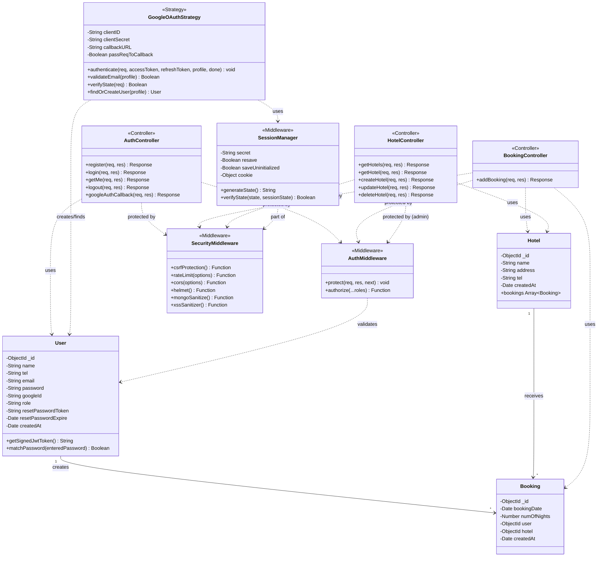

# Class Diagram - Hotel Booking System

## UML Class Diagram



## Detailed Class Specifications

### Model Classes

#### User
```typescript
class User extends Model {
    // Attributes
    private _id: ObjectId                    // Unique identifier
    private name: String                     // Required, max 50 chars
    private tel: String                      // Conditional required (if !googleId)
                                            // Pattern: /^[0-9]{10}$/
    private email: String                    // Required, unique, validated
    private password: String                 // Required, min 6 chars, select: false
    private googleId: String                 // Unique, sparse index
    private role: String                     // Enum: ['user', 'admin'], default: 'user'
    private resetPasswordToken: String       // For password reset
    private resetPasswordExpire: Date        // Token expiration
    private createdAt: Date                  // Auto-generated
    
    // Methods
    + getSignedJwtToken(): String {
        // Returns JWT token signed with user ID
        // Expires in 30 days (from config)
    }
    
    + matchPassword(enteredPassword: String): Boolean {
        // Compares plain password with hashed password
        // Returns true if match, false otherwise
    }
    
    // Middleware Hooks
    pre('save') {
        // Hashes password if modified
        // Uses bcrypt with salt rounds
    }
}
```

**Constraints:**
- `name`: Required, max 50 characters
- `tel`: Required only if not OAuth user, must match `/^[0-9]{10}$/`
- `email`: Required, unique, must be valid email format
- `password`: Required, minimum 6 characters, never returned in queries
- `googleId`: Unique but sparse (allows nulls)
- `role`: Default 'user', can be 'admin'

**Relationships:**
- One-to-Many with Booking (One user can have many bookings)

---

#### Booking
```typescript
class Booking extends Model {
    // Attributes
    private _id: ObjectId                    // Unique identifier
    private bookingDate: Date                // Required, booking start date
    private numOfNights: Number              // Required, min: 1, max: 3
    private user: ObjectId                   // Reference to User, required
    private hotel: ObjectId                  // Reference to Hotel, required
    private createdAt: Date                  // Auto-generated timestamp
    
    // No methods (pure data model)
}
```

**Constraints:**
- `bookingDate`: Required, must be Date type
- `numOfNights`: Required, minimum 1, maximum 3
- `user`: Required reference to User model
- `hotel`: Required reference to Hotel model

**Business Rules:**
- Maximum 3 bookings per user (enforced in controller)
- Maximum 3 nights per booking (enforced in schema)
- Minimum 1 night per booking (enforced in schema)

**Relationships:**
- Many-to-One with User (Many bookings belong to one user)
- Many-to-One with Hotel (Many bookings belong to one hotel)

---

#### Hotel
```typescript
class Hotel extends Model {
    // Attributes
    private _id: ObjectId                    // Unique identifier
    private name: String                     // Required, unique, max 50 chars
    private address: String                  // Required
    private tel: String                      // Required, contact number
    private createdAt: Date                  // Auto-generated
    
    // Virtual Properties
    + bookings: Array<Booking>               // Populated from Booking model
    
    // No methods (pure data model)
}
```

**Constraints:**
- `name`: Required, unique, max 50 characters
- `address`: Required
- `tel`: Required

**Virtual Properties:**
- `bookings`: Virtual populate - shows all bookings for this hotel

**Relationships:**
- One-to-Many with Booking (One hotel can have many bookings)

---

### Controller Classes

#### AuthController
```typescript
class AuthController {
    /**
     * Register new user with basic credentials
     * POST /api/v1/auth/register
     */
    + register(req: Request, res: Response): Response {
        // 1. Extract name, tel, email, password from body
        // 2. Validate required fields
        // 3. Create user in database (password auto-hashed)
        // 4. Generate JWT token
        // 5. Set cookie
        // 6. Return user data and token
    }
    
    /**
     * Login user with email and password
     * POST /api/v1/auth/login
     */
    + login(req: Request, res: Response): Response {
        // 1. Extract email, password from body
        // 2. Find user by email (include password)
        // 3. Verify password using matchPassword()
        // 4. Generate JWT token
        // 5. Set cookie
        // 6. Return user data and token
    }
    
    /**
     * Get current logged-in user
     * GET /api/v1/auth/me
     * Protected route
     */
    + getMe(req: Request, res: Response): Response {
        // 1. User already attached to req by protect middleware
        // 2. Return user data (password excluded)
    }
    
    /**
     * Logout user (clear cookie)
     * GET /api/v1/auth/logout
     */
    + logout(req: Request, res: Response): Response {
        // 1. Clear authentication cookie
        // 2. Return success message
    }
    
    /**
     * Handle Google OAuth callback
     * GET /api/v1/auth/google/callback
     * Called by Passport after successful OAuth
     */
    + googleAuthCallback(req: Request, res: Response): Response {
        // 1. Verify user exists (set by Passport)
        // 2. Generate JWT token with user ID
        // 3. Set HTTP-only cookie with security flags:
        //    - httpOnly: true (prevent XSS)
        //    - secure: true in production (HTTPS only)
        //    - sameSite: 'lax' (allow OAuth redirect)
        //    - expires: 30 days
        // 4. Build user data object (without password)
        // 5. Clear OAuth state from session (CSRF cleanup)
        // 6. Redirect to frontend with encoded user data
        // 7. Token sent both in cookie (primary) and URL (fallback)
    }
    
    /**
     * Forgot password - send reset email
     * POST /api/v1/auth/forgotpassword
     * Public route
     */
    + forgotPassword(req: Request, res: Response): Response {
        // 1. Find user by email
        // 2. Generate reset token
        // 3. Save hashed token to database
        // 4. Send email with reset link
        // 5. Sanitize email to prevent XSS
    }
    
    /**
     * Reset password with token
     * PUT /api/v1/auth/resetpassword/:resettoken
     * Public route
     */
    + resetPassword(req: Request, res: Response): Response {
        // 1. Hash token from URL
        // 2. Find user with valid token
        // 3. Verify token not expired
        // 4. Update password
        // 5. Clear reset token
        // 6. Return JWT token
    }
}
```

---

#### BookingController
```typescript
class BookingController {
    /**
     * Create new booking
     * POST /api/v1/hotels/:hotelId/bookings
     * Protected route - requires authentication
     */
    + addBooking(req: Request, res: Response): Response {
        // 1. Extract hotelId from params
        // 2. Extract bookingDate, numOfNights from body
        // 3. Verify hotel exists
        // 4. Count user's existing bookings
        // 5. Validate max 3 bookings rule
        // 6. Validate numOfNights (1-3)
        // 7. Create booking
        // 8. Return booking data
    }
}
```

**Business Logic:**
- Validates hotel existence before creating booking
- Enforces "max 3 bookings per user" rule
- Validates "1-3 nights" constraint
- Associates booking with authenticated user

---

#### HotelController
```typescript
class HotelController {
    /**
     * Get all hotels
     * GET /api/v1/hotels
     * Public route
     */
    + getHotels(req: Request, res: Response): Response {
        // 1. Query all hotels from database
        // 2. Return hotels array
    }
    
    /**
     * Get single hotel by ID
     * GET /api/v1/hotels/:id
     * Public route
     */
    + getHotel(req: Request, res: Response): Response {
        // 1. Extract id from params
        // 2. Find hotel by id
        // 3. Return hotel data
    }
    
    /**
     * Create new hotel
     * POST /api/v1/hotels
     * Protected - Admin only
     */
    + createHotel(req: Request, res: Response): Response {
        // 1. Extract name, address, tel from body
        // 2. Validate required fields
        // 3. Create hotel in database
        // 4. Return hotel data
    }
    
    /**
     * Update hotel
     * PUT /api/v1/hotels/:id
     * Protected - Admin only
     */
    + updateHotel(req: Request, res: Response): Response {
        // 1. Extract id from params
        // 2. Extract update data from body
        // 3. Find and update hotel
        // 4. Return updated hotel data
    }
    
    /**
     * Delete hotel
     * DELETE /api/v1/hotels/:id
     * Protected - Admin only
     */
    + deleteHotel(req: Request, res: Response): Response {
        // 1. Extract id from params
        // 2. Find and delete hotel
        // 3. Return success message
    }
}
```

---

### Middleware Classes

#### AuthMiddleware
```typescript
class AuthMiddleware {
    /**
     * Protect routes - verify JWT token
     * Attaches user to request object
     */
    + protect(req: Request, res: Response, next: NextFunction): void {
        // 1. Extract token from header or cookie
        // 2. Verify token with JWT secret
        // 3. Decode user ID from token
        // 4. Find user in database
        // 5. Attach user to req.user
        // 6. Call next() or return 401 error
    }
    
    /**
     * Authorize specific roles
     * Must be used after protect middleware
     */
    + authorize(...roles: String[]): Function {
        // Returns middleware function that:
        // 1. Checks if req.user.role is in allowed roles
        // 2. Call next() if authorized
        // 3. Return 403 error if not authorized
    }
}
```

**Usage Examples:**
```javascript
// Protect route (any authenticated user)
router.post('/bookings', protect, addBooking);

// Protect and authorize (admin only)
router.post('/hotels', protect, authorize('admin'), createHotel);

// Protect and authorize (multiple roles)
router.get('/data', protect, authorize('admin', 'user'), getData);
```

---

### Strategy Classes

#### GoogleOAuthStrategy
```typescript
class GoogleOAuthStrategy {
    // Configuration
    private clientID: String                 // From env: GOOGLE_CLIENT_ID
    private clientSecret: String             // From env: GOOGLE_CLIENT_SECRET
    private callbackURL: String              // From env: GOOGLE_CALLBACK_URL
    private passReqToCallback: Boolean       // Enable req access in callback
    
    /**
     * Authenticate user via Google OAuth 2.0
     * Called by Passport.js with enhanced security
     */
    + authenticate(
        req: Request,
        accessToken: String,
        refreshToken: String,
        profile: Object,
        done: Function
    ): void {
        // 1. Validate email exists in profile
        // 2. Validate email is verified by Google
        // 3. Verify state parameter (CSRF protection)
        // 4. Find user by googleId (primary lookup)
        // 5. If not found, find by email (fallback)
        // 6. If user exists:
        //    a. Update googleId if not set
        //    b. Return existing user
        // 7. If not exists:
        //    a. Extract name from profile
        //    b. Generate cryptographically secure random password (64 chars)
        //    c. Store googleId from profile
        //    d. Set default tel: '0000000000'
        //    e. Create new user
        // 8. Return user or error via done callback
    }
    
    + validateEmail(profile: Object): Boolean {
        // Validates email exists and is verified
        // Throws error if validation fails
    }
    
    + verifyState(req: Request): Boolean {
        // Compares state from query with session
        // Returns true if match, throws error if mismatch
    }
    
    + findOrCreateUser(profile: Object): Promise<User> {
        // Encapsulates user lookup/creation logic
        // Returns user object or throws error
    }
        //    d. Create new user
        // 5. Call done(null, user) on success
        // 6. Call done(error, null) on failure
    }
}
```

**Enhanced OAuth Flow with Security:**
1. User clicks "Sign in with Google"
2. System generates CSRF state token
3. State stored in server session
4. Redirected to Google authentication with state
5. User authorizes app
6. Google redirects to callback URL with code + state
7. System verifies state matches session (CSRF check)
8. Passport exchanges code for access token
9. Passport fetches user profile from Google
10. Strategy validates email is verified
11. Strategy finds or creates user
12. JWT token generated
13. HTTP-only cookie set with security flags
14. User authenticated and redirected to frontend

---

### New Security Classes

#### SessionManager
```typescript
class SessionManager {
    private secret: String                   // Session secret
    private resave: Boolean                  // false
    private saveUninitialized: Boolean       // false
    private cookie: {
        secure: Boolean,                     // true in production
        httpOnly: Boolean,                   // true
        maxAge: Number                       // 10 minutes
    }
    
    + generateState(): String {
        // Generate cryptographically secure random state
        // Uses crypto.randomBytes(32).toString('hex')
    }
    
    + verifyState(state: String, sessionState: String): Boolean {
        // Compare state parameter with session
        // Returns true if match, false otherwise
    }
}
```

#### SecurityMiddleware
```typescript
class SecurityMiddleware {
    + csrfProtection(): Function {
        // CSRF protection using csrf-csrf package
        // Generates and validates CSRF tokens
    }
    
    + rateLimit(options: Object): Function {
        // Rate limiting middleware
        // Options: windowMs, max, message
        // OAuth: 10 req/15min
        // Auth: 5 req/15min
    }
    
    + cors(options: Object): Function {
        // CORS configuration
        // Allows specific origins only
        // Credentials: true
    }
    
    + helmet(): Function {
        // Security headers middleware
        // Sets various HTTP headers
    }
    
    + mongoSanitize(): Function {
        // Prevents MongoDB injection
        // Removes $ and . from input
    }
    
    + xssSanitizer(): Function {
        // XSS prevention
        // Sanitizes user input
    }
}
```

---

## Class Relationships

### Association Relationships

1. **User → Booking** (One-to-Many)
   - One user can create multiple bookings
   - Each booking belongs to exactly one user
   - Cardinality: 1..* (user can have 0 to many bookings)
   - Business constraint: Maximum 3 bookings per user

2. **Hotel → Booking** (One-to-Many)
   - One hotel can have multiple bookings
   - Each booking is for exactly one hotel
   - Cardinality: 1..* (hotel can have 0 to many bookings)

### Dependency Relationships

1. **Controllers → Models**
   - AuthController depends on User model
   - BookingController depends on Booking and Hotel models
   - HotelController depends on Hotel model
   - Controllers create, read, update, delete model instances

2. **GoogleOAuthStrategy → User**
   - Strategy creates or finds User instances
   - Dependency for authentication flow

3. **AuthMiddleware → User**
   - Middleware validates and loads User instances
   - Dependency for route protection

4. **Controllers → Middleware**
   - Controllers are protected by AuthMiddleware
   - Middleware runs before controller methods

---

## Design Patterns Used

### 1. MVC (Model-View-Controller)
- **Models:** User, Booking, Hotel
- **Controllers:** AuthController, BookingController, HotelController
- **Views:** JSON responses (RESTful API)

### 2. Strategy Pattern
- GoogleOAuthStrategy implements authentication strategy
- Easily extensible (could add FacebookStrategy, etc.)

### 3. Middleware Pattern
- AuthMiddleware intercepts requests
- Modular authentication and authorization

### 4. Repository Pattern
- Mongoose models act as repositories
- Abstract database operations

---

## Stereotype Descriptions

- `<<Controller>>` - Handles HTTP requests and responses
- `<<Middleware>>` - Intercepts and processes requests
- `<<Strategy>>` - Implements authentication strategy
- `<<Model>>` - Data model with business logic

---

## Notes for Presentation

1. **Changed from Assignment 7:**
   - Hospital → Hotel
   - Appointment → Booking
   - User model enhanced with `googleId` and conditional `tel`

2. **Key Design Decisions:**
   - JWT for stateless authentication
   - Middleware for route protection
   - Strategy pattern for OAuth extensibility
   - Virtual populate for hotel-booking relationship

3. **Security Considerations:**
   - Password never returned in queries
   - JWT tokens expire after 30 days
   - Role-based access control (RBAC)
   - bcrypt password hashing

4. **Business Rule Enforcement:**
   - Max 3 bookings per user (controller)
   - Max 3 nights per booking (schema)
   - Unique hotel names (schema)
   - Conditional tel requirement (schema)
