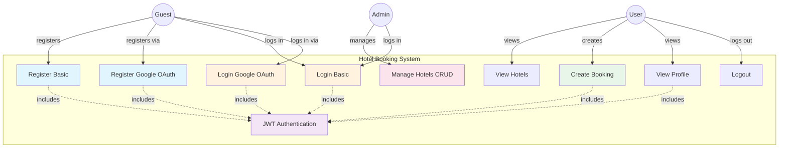

# Use Case Diagram - Hotel Booking System

## Visual Representation

## Use Case Descriptions

### UC1: Register (Basic Authentication)
- **Actor:** Guest
- **Precondition:** User is not registered
- **Main Flow:**
  1. User provides name, telephone number (10 digits), email, and password
  2. System validates input data
  3. System hashes password using bcrypt
  4. System creates new user account
  5. System generates JWT token
  6. System returns user data and token
- **Postcondition:** User is registered and logged in
- **Business Rules:**
  - Email must be unique
  - Password minimum 6 characters
  - Tel must be 10 digits
  - Default role is 'user'

### UC2: Register (Google OAuth)
- **Actor:** Guest
- **Precondition:** User has Google account
- **Main Flow:**
  1. User clicks "Sign in with Google"
  2. System redirects to Google authentication
  3. User authorizes the application
  4. Google returns user profile
  5. System checks if user exists by email
  6. If not exists, system creates new user
  7. System generates JWT token
  8. System returns user data and token
- **Postcondition:** User is registered/logged in via OAuth
- **Business Rules:**
  - Email from Google is used as unique identifier
  - Phone number is optional for OAuth users
  - Random password is generated (not used)
  - GoogleId is stored for future authentication

### UC3: Login (Basic Authentication)
- **Actor:** Guest/User
- **Precondition:** User is registered
- **Main Flow:**
  1. User provides email and password
  2. System validates credentials
  3. System verifies password using bcrypt
  4. System generates JWT token
  5. System returns user data and token
- **Postcondition:** User is logged in
- **Business Rules:**
  - Password must match hashed password
  - Token expires after 30 days

### UC4: Login (Google OAuth)
- **Actor:** Guest/User
- **Precondition:** User has Google account
- **Main Flow:**
  1. User clicks "Sign in with Google"
  2. System redirects to Google authentication
  3. User authorizes the application
  4. Google returns user profile
  5. System finds existing user by email
  6. System generates JWT token
  7. System returns user data and token
- **Postcondition:** User is logged in via OAuth
- **Business Rules:**
  - User must exist in database
  - If not exists, automatically registers (UC2)

### UC5: View Hotels
- **Actor:** User/Admin/Guest
- **Precondition:** None
- **Main Flow:**
  1. User requests hotel list
  2. System retrieves all hotels from database
  3. System returns hotel data (name, address, tel)
- **Postcondition:** User sees available hotels
- **Business Rules:**
  - Public endpoint (no authentication required)
  - Returns all active hotels

### UC6: Create Booking
- **Actor:** User
- **Precondition:** User is authenticated
- **Main Flow:**
  1. User selects hotel and booking details
  2. User provides booking date and number of nights
  3. System validates JWT token
  4. System checks hotel exists
  5. System counts user's existing bookings
  6. System validates business rules
  7. System creates booking
  8. System returns booking confirmation
- **Postcondition:** Booking is created
- **Business Rules:**
  - User must be authenticated (JWT required)
  - Maximum 3 bookings per user
  - Maximum 3 nights per booking
  - Minimum 1 night per booking
  - Hotel must exist
- **Alternative Flow:**
  - If user has 3 bookings: Return error
  - If nights > 3 or < 1: Return validation error
  - If hotel not found: Return 404 error

### UC7: View Profile
- **Actor:** User
- **Precondition:** User is authenticated
- **Main Flow:**
  1. User requests profile data
  2. System validates JWT token
  3. System retrieves user data from token
  4. System returns user information
- **Postcondition:** User sees their profile
- **Business Rules:**
  - Password is not returned
  - Token must be valid

### UC8: Logout
- **Actor:** User
- **Precondition:** User is logged in
- **Main Flow:**
  1. User requests logout
  2. System clears authentication cookie
  3. System confirms logout
- **Postcondition:** User is logged out
- **Business Rules:**
  - Token should be removed from client
  - Cookie is set to expire

### UC9: Manage Hotels (Admin CRUD)
- **Actor:** Admin
- **Precondition:** User has admin role
- **Main Flow:**
  1. Admin authenticates
  2. Admin performs CRUD operations:
     - Create: Add new hotel
     - Read: View hotel details
     - Update: Modify hotel information
     - Delete: Remove hotel
  3. System validates admin role
  4. System performs requested operation
- **Postcondition:** Hotel data is modified
- **Business Rules:**
  - Only users with 'admin' role can access
  - JWT token required
  - Hotel name must be unique

### UC10: JWT Authentication (Included)
- **Actor:** System
- **Type:** Include relationship
- **Description:** 
  - Validates JWT token in request headers
  - Extracts user ID from token
  - Loads user data from database
  - Attaches user to request object
  - Used by all protected routes

## Actor Descriptions

### Guest
- **Description:** Unauthenticated visitor
- **Capabilities:**
  - Register (Basic or OAuth)
  - Login (Basic or OAuth)
  - View Hotels (public)
- **Limitations:**
  - Cannot create bookings
  - Cannot access protected routes

### User
- **Description:** Registered and authenticated user
- **Capabilities:**
  - All Guest capabilities
  - Create bookings (up to 3, max 3 nights each)
  - View own profile
  - Logout
- **Limitations:**
  - Cannot manage hotels
  - Cannot view other users' data

### Admin
- **Description:** User with administrative privileges
- **Capabilities:**
  - All User capabilities
  - Create, read, update, delete hotels
  - Access administrative functions
- **Limitations:**
  - None within system scope

## System Boundary
- **Inside:** All use cases (UC1-UC10)
- **Outside:** Google OAuth API, MongoDB Database

## Include Relationships
- UC1, UC2, UC3, UC4, UC6, UC7 **include** UC10 (JWT Authentication)

## Extend Relationships
- None in current implementation

## Generalization Relationships
- User generalizes to Admin (Admin is a specialized User)

---

## Notes for Presentation
1. This diagram shows **Requirements 1-3** implementation only
2. **Requirements 4-9** (view/edit/delete bookings) are **NOT implemented**
3. **Google OAuth** is an enhancement beyond original requirements
4. **JWT Authentication** is a cross-cutting concern used by multiple use cases
5. System focuses on **booking creation only**, not management
